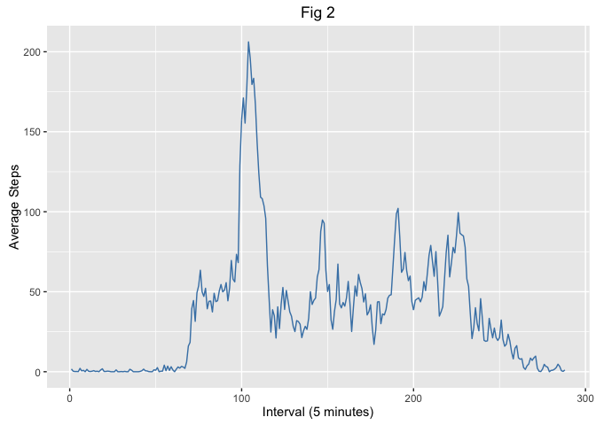

# Reproducible Research: Peer Assessment 1
Nick Menere  


## Loading and preprocessing the data

Unzip the file - *activity.zip* and load the data from *activity.csv*. The file contains data in the form - steps, date, interval
Missing values are represented by "NA".
Dates are loaded as strings but converted to POSIXct for easy processing. 
We then also calculate the index of the interval as this will give a uniform distribution of intervals. With the raw interval it is in the format 'hhmm'.  This means the measurement after 55 is 100.  Plotting against this will give incorrect shapped graphs.

```r
unzip(zipfile = "activity.zip")
activity <- read.csv(file="activity.csv")
activity$date <-as.POSIXct(strptime(activity$date, "%Y-%m-%d"))
## divide the hours by 100 and times that by 60.
## Add it to the minutes to get the total minutes
## Divide it by 5 (the interval length).  This is 0 based so we need to add 1
activity$interval_idx <- ((activity$interval %/% 100) * 60 + activity$interval %% 100)/ 5 + 1
```

## What is mean total number of steps taken per day?
To determine how many steps are taken per day we will first, as instructed, remove values that are missing or incomplete, then group by the day and then add all measurements for that day.

We then use ggplot to draw a histogram (Fig 1) to show the frequency of steps taken per day.  We have broken up the data in bins 1000 steps wide.

```r
total_by_day <- activity[complete.cases(activity),] %>% group_by(date) %>% 
    summarise(total_steps = sum(steps, na.rm=TRUE))

day_mean <- mean(total_by_day$total_steps)
day_median <- median(total_by_day$total_steps)

ggplot(total_by_day, aes(total_steps)) + 
    geom_histogram(fill = "steelblue", color = "steelblue4", binwidth = 1000) +
    geom_vline(xintercept = day_mean) + 
    labs(y = "Frequency", 
         x = "Total number of steps per day", 
         title = "Fig 1")
```


The mean for steps taken per day is 10766.19 and is shown in Fig 1 with the black line.  The median is 10765.

## What is the average daily activity pattern?
We want to look at the activity over the day. To do this we will group by the interval and a get the average for the measurements in each bucket. 
I used ggplot to create a line graph of average steps vs the interval index.


```r
avg_by_interval <- activity %>% group_by(interval_idx) %>% 
    summarise(avg_steps = mean(steps, na.rm=TRUE))
## The interval index is used as this gives a uniform distribution of measurements on the x-axis.
ggplot(data = avg_by_interval, aes(x=interval_idx, y=avg_steps)) +
    geom_line(color = "steelblue") +
    labs(x = "Interval (5 minutes)",
         y = "Average Steps",
         title = "Fig 2")
```



The next part of the question is to calculate which interval has the highest average steps. We retrieve the index of the highest average and then retrieve the interval at this index.

```r
## What is the interval with the highest average steps.
avg_by_interval$interval[which.max(avg_by_interval$avg_steps)]
```

```
## [1] 104
```

## Imputing missing values
We have quite a few holes in the data, so rather just ignore them, we will fill them in using the average for that interval accross all other days and see what effect this has on the distribution and mean using the same process as we did to produce Fig 1.
We copy the activity data and populate a the steps with the averages calculated in the previous step.  We then overlay the actual measurements.


```r
missing_val_idx = is.na(activity$steps)
sum(missing_val_idx)
```

```
## [1] 2304
```

```r
imputed_activity <- activity
imputed_activity$steps <- avg_by_interval$avg_steps
imputed_activity$steps[!missing_val_idx] <- activity$steps[!missing_val_idx]

total_by_day_imputed <- imputed_activity %>% group_by(date) %>% 
    summarise(total_steps = sum(steps, na.rm=TRUE))

ggplot(total_by_day_imputed, aes(total_steps)) + 
    geom_histogram(fill = "steelblue", color = "steelblue4", binwidth = 1000) +
    labs(y = "Frequency", 
         x = "Total number of steps per day", 
         title = "Fig 3")
```


```r
mean(total_by_day_imputed$total_steps)
```

```
## [1] 10766.19
```

```r
median(total_by_day_imputed$total_steps)
```

```
## [1] 10766.19
```

The mean is exactly the same while the median has increased slightly.
Eyeballing the graphs, the distrubtion has the same shape but it has been stretched along the y-axis.  Looking at the raw data and what values are missing, it looks as though missing data occurs in blocks of whole days. By replacing these chunks with the averages for the intervals for the whole day would produce this result.

## Are there differences in activity patterns between weekdays and weekends?

To compare weekdays to weekends we need to be able the bucket the data into to 2 groups. We add a column to the imputed data from the previous section and then, based on date, set a marker as to whether it falls on a weekday or weekend.
We then use the same method that produced Fig 2 to produce Fig 4, but we seperate the the two groups by decalaring a facet.

```r
days <- weekdays(imputed_activity$date)
imputed_activity$weekday <- ifelse(days == "Saturday" | days == "Sunday", 
                                   "Weekend", "Weekday")

avg_by_daytype <- imputed_activity %>% group_by(weekday, interval_idx) %>% 
    summarise(avg_steps = mean(steps, na.rm=TRUE))

ggplot(avg_by_daytype, aes(interval_idx, avg_steps)) + 
    geom_line(color = "steelblue") + 
    facet_wrap(~weekday, ncol = 1) +
    labs(x = "Interval (5 minutes)", y = "Total Steps", title="Fig 4")
```


Activity end and starts roughly at the same times, though there is an imediate spike on weekdays where as weekends start off more gradually. The weekday steps are heavily weighted to the morning while the weekend graph has a higher load throughout the day.

